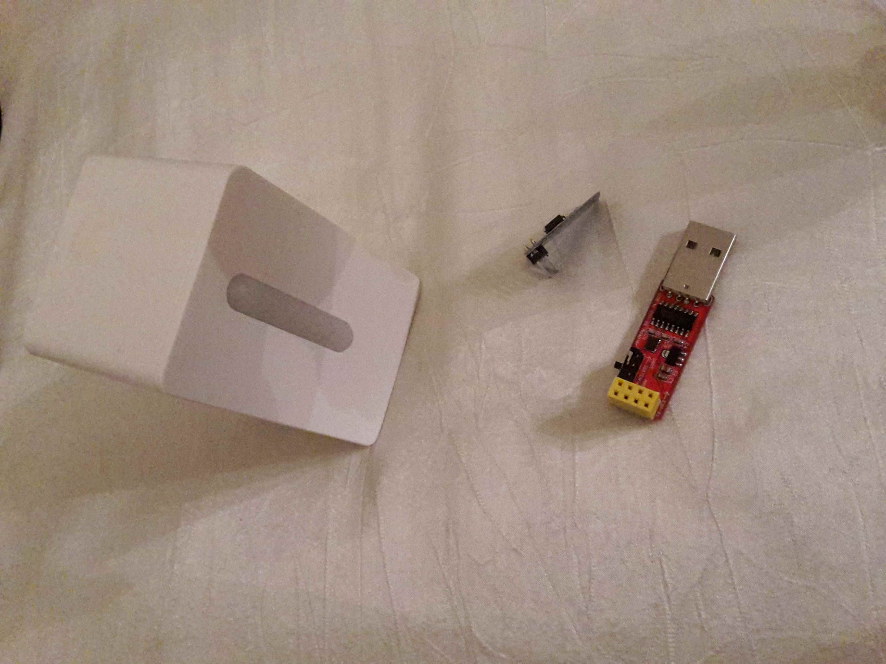
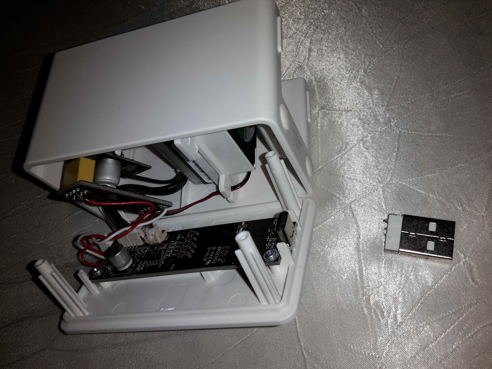
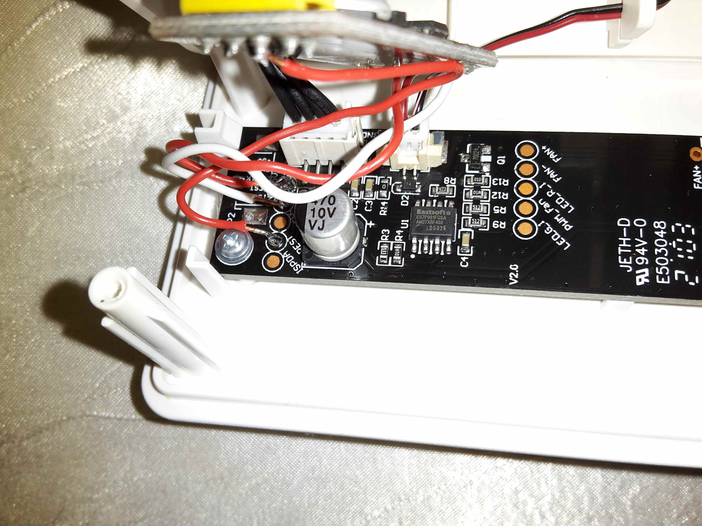
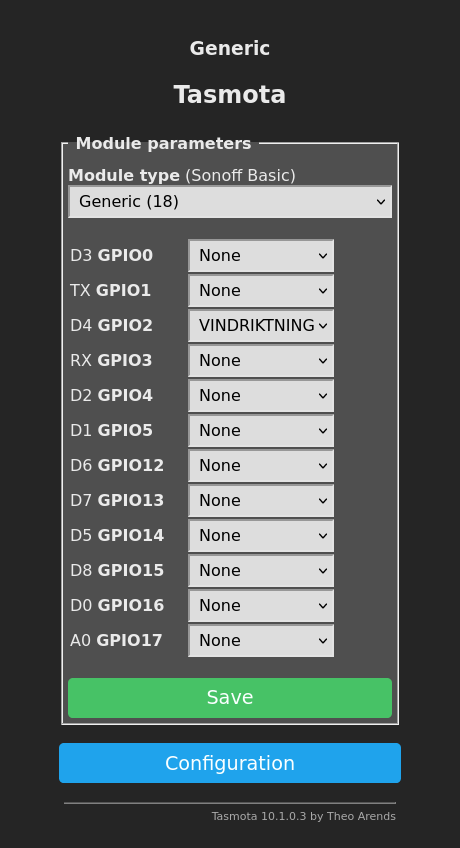

# Thema Feinstaubsensor und python/jupyter auf dem Raspberry

Der IKEA Vindriktning FeinstaubSensor wurde (auch) von uns gehackt und
sendet dadurch via MQTT und WLAN seine Daten ins Netz.
https://www.cnx-software.com/2021/11/10/ikea-pm2-5-air-quality-sensor-esp8266-wifi-hack-mqtt-tasmota/

Wir wollten Erfahrung mit dem python/jupyter notebook machen.
https://jupyter.org/try

Die Aufgabe war, damit obige MQTT Daten zu sammeln und zu visualisieren.

## Hardware

Alle Teile im Überblick

- IKEA Vindriktning FeinstaubSensor
- ESP01(ESP8266)
- USB to ESP01(ESP8266) Serial Adapter Board



Der USB Anschluss des "USB to ESP01(ESP8266) Serial Adapter Board" wird **nach dem Flashen** aus Platzgründen entfernt. Denn nach dem Flashen dient der "USB to ESP01(ESP8266) Serial Adapter Board" nur noch als Voltage Converter zwischen 5V USB (Vindriktning) und 3,3V (ESP8266).


So wurden Vindriktning und ESP8266 verbunden.



## Software Voraussetzungen

* eine vorhanden Python Installation.
* ein MQTT Server ist erreichbar

## Tasmota auf ESP01 bringen


``` bash
pip install esptool
```

Download tasmota for esp32 from:

https://github.com/tasmota/install/blob/main/firmware/unofficial/tasmota-allsensors.bin

Tasmota Firmware auf ESP01 flashen:

``` bash
esptool --port /dev/ttyUSB0 write_flash -fm dout -fs 1MB 0x00000 tasmota-allsensors.bin
```

## Tasmota konfigurieren

### Tasmota Wifi konfigurieren

### Tasmota MQTT konfigurieren
Die MQTT Message Frequenz auf all 60 Sekunden einstellen durch die Eingabe des Kommandos "TelePeriod 60" auf der Tasmota Console. 

### Tasmota Module (Gerät Vindriktning) konfigurieren

Der ESP8266 via Pin "D4 GPIO2" mit dem Vindriktning verlötet.



## Das jupyter notebook auf dem Raspberry installieren

``` bash
# pip install notebook
pip3 install notebook
pip3 install paho-mqtt

pip3 install matplotlib
# jupyter notebook

.local/bin/jupyter notebook password

.local/bin/jupyter notebook --port=7777

```

``` bash
# On the other client ssh to 192.168.179.2 via:
ssh -L 7777:localhost:7777 pi@192.168.179.2
# and start browser with: http://localhost:7777
```

Das fertige Notebook steht unter  zur Verfügung. 

## Hilfreiche Links

- https://www.cnx-software.com/2021/11/10/ikea-pm2-5-air-quality-sensor-esp8266-wifi-hack-mqtt-tasmota/
- https://github.com/tasmota/install/blob/main/firmware/unofficial/tasmota-allsensors.bin
- https://jupyter.org/try
- https://stackoverflow.com/questions/50982686/what-is-the-difference-between-jupyter-notebook-and-jupyterlab#52392304
- https://stackoverflow.com/questions/4098131/how-to-update-a-plot-in-matplotlib
- https://jupyter-notebook.readthedocs.io/en/stable/security.html
- https://docs.anaconda.com/anaconda/user-guide/tasks/remote-jupyter-notebook/
- https://pypi.org/project/paho-mqtt
- https://www.tutorialspoint.com/jupyter/jupyter_notebook_plotting.htm

